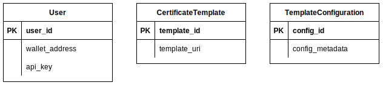

# Back-end Specification

## REST API Endpoints

### User

|     Tables    |  HTTP request method  |        Params        | Request body |
|---------------|:---------------------:|:--------------------:|:------------:|
| `/users/auth` |          POST         |                      |     JSON     |

### Certificate

|           Tables          |  HTTP request method  |        Params        | Request body |
|---------------------------|:---------------------:|:--------------------:|:------------:|
| `/certificates/save`      |          POST         |                      |     JSON     |
| `/certificates/configure` |          GET          | `template_config_id` |     JSON     |
| `/certificates/generate`  |          POST         |                      |     JSON     |
| `/certificates/transfer`  |          GET          |                      |     JSON     |
| `/certificates/verify`    |          GET          | `certificate_id`     |     JSON     |

## Database

