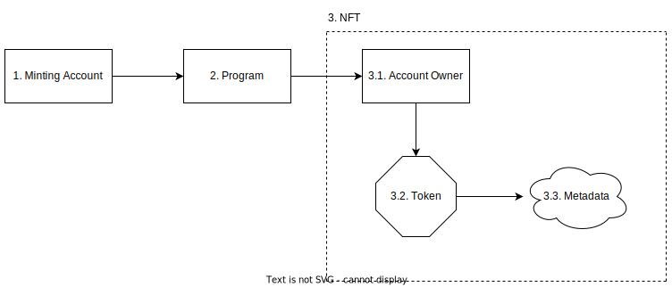

# E-Certificate

A digital representation of an official document attesting the legitimacy of the holder’s achievement.

## Background

This definitions of the terms used in this document are available at:

- [https://docs.solana.com/terminology](https://docs.solana.com/terminology)

## E-Certificates and Non-Fungible Tokens

An e-Certificate is represented by a [non-fungible token (NFT)](https://en.wikipedia.org/wiki/Non-fungible_token). This token is then transferred to the recipient’s [associated token account](https://spl.solana.com/associated-token-account). The token has an associated metadata which contains a link to the original copy of the e-Certificate which is stored in a [distributed storage system](https://docs.metaplex.com/guides/storage-overview).

*Figure 1. Common implementation for Non-Fungible tokens.*

## 1. Minting Account

The system will use Solana’s SPL Token tooling to mint a new token and set the supply to 1. Then it will freeze all minting of that token. This is what will make tokens unique. There can only be one, programmatically. NFTs are just tokens with some associated metadata. The minting account is the first user who mints or publishes the token for the first time on the blockchain. Following that, any accounts involved simply have the NFT transferred to them.

## 2. Program

The system and the program which the user will use to mint an NFT. It is an on-chain program that will
administer the transactions for handling the NFT.

## 3. NFT

The minting account owns the token, which is associated with some metadata. The metadata is stored
in a separate account and is referenced by the token.

## *3.1 Account Owner*

[The program's address that owns the account.](https://docs.solana.com/terminology#account-owner)

## *3.2 Token*

The digital asset that proves digital ownership of the e-Certificate, i.e., the NFT itself.

## *3.3 Metadata*

A set of data containing information about the NFT, including the link to the original copy of the e-Certificate

Once minted, the NFT belongs to the account that minted it. The owner can then transfer it to any Solana account using a simple *transfer transaction*. The sending of the NFT is controlled by the on-chain program(s) included with the system. When the owner decides to transfer the NFT, the token that represents the e-Certificate, the program(s) will transfer the NFT from the owner to the recipient.

To learn more, please refer to Solana’s token program: [https://spl.solana.com/token](https://spl.solana.com/token)

## E-Certificate Verification

An E-Certificate is a verfiable digital asset; the NFT metadata contains a certificate ID.

The certificate ID is composed of two [xxh3](http://cyan4973.github.io/xxHash/) hashed values.

Example certificate ID: `a352ee326de02bf5-34046bb609f00ff1`

The former part of the certificate ID identifies the data storage that can help verify the legitimacy of the e-Certificate. The latter part is a unique identifier assigned to the e-Certificate.

> Note: Ideally, the data storage should contain the public wallet address of the issuer (key) and the latter part of the certificate ID (value).

## E-Certificate Verification System

This section justifies the implementation of the verification system.

Certinize integrates programs and software for an unconventional approach to distributing e-Certificates, its verification process gets complicated.

The problem with automatically verifying and registering institutions/companies: It can lead to impostors and scams.

Since issuing an e-Certificate requires recipients to send cryptocurrency to the issuer can lead to fraud, a pragmatic approach as well as a security verification system is necessary. Scammers can use the information of an entity in a fraudulent manner to swindle users of their cryptocurrency. 

Solution:

### Option 1: We manually verify users before registering them in our immediate or centralized database, then we can automate the verification process.

Summary: Centralized Approach

We can verify users or issuers by manually checking their email, website, telephone number, and physical address. The downside is that we have to manually verify them again if they want to use a different public key or wallet address to distribute e-Certificates. This process would become a bit complicated if a subsidiary wants to distribute its own e-Certificates using a similar name but with a different wallet. The subsidiary will not be able to verify itself as the necessary information is already taken by the holding company.

Other advantages:

- It allows us to implement a standard, allowing other clients to implement their own e-Certificate issuance flow.

### Option 2: Let users verify themselves. The verification process is manually and personally done by users.

Summary: Decentralized Approach

This approach appears more flexible for both the issuer and Certinize. The issuer can provide any information users can utilize to verify the legitimacy of the issuance. Moreover, the issuer would be able to quickly modify their information per issuance.

The downside is the platform will not be able to automatically verify the legitimacy of the issuer and e-certificate. Users will have to do it themselves if they want to know if the issuer is an actual representative of a company or institution or if the e-Certificate actually came from a certain entity. Another downside is that manually checking is a tedious process. Users will want to check in advance if the wallet address or public key of the issuer actually belongs to a certain company or institution. There are many ways to do it, and you can do them in combination to be more certain, but doing so is a tedious process and goes beyond the knowledge of common folks.

---

If the one facilitating the verification process is the one who issued the e-certificate, verifying an e-certificate would be easy and straightforward. As a recipient, you already know the issuer is legitimate because the process, the platform, or the system, is registered with their name. The system, Certinize, may serve as a third-party platform.

We don't have to verify if an e-Certificate was actually issued by someone because the blockchain does that for us. We may simplify that process for the user. Right now, what we need to do is provide a verification system that can attest to the legitimacy of the issuer. In this case, we need to check if the wallet address used to issue an e-Certificate actually belongs to a verified company or institution.

The system aims to streamline the processes of distributing and verifying e-Certificates. However, it should not do so by burdening users. For this reason, combining both options seems to be the best approach.

For option 1:
- What would be the structure of the storage system for verified issuers?
- How do users register for verification?
- What is the process of manually verifying users?
